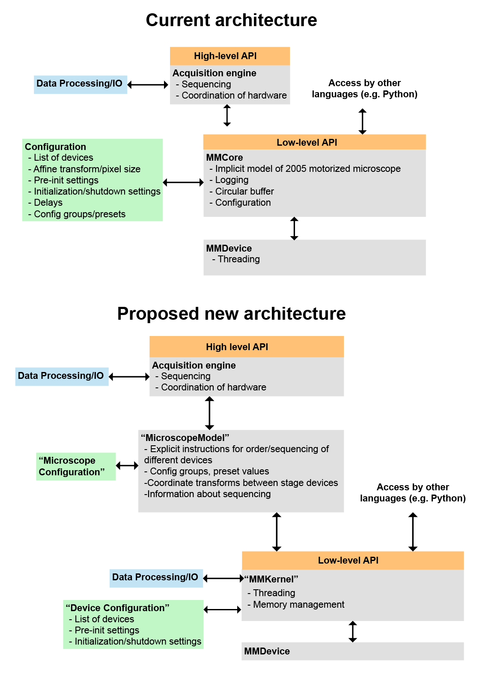

# futureMMCore
Place to discuss the future design of a universal microscope hardware interface

An introducotry bit about 
1. **TODO** The original Micro-Manager core API/architecture has seen many huge successes
2. **TODO** How micromanger has grown to a large community of users and its other successes 

However, as new types of microscopes increasingly use novel types of hardware, complex robotic automation, produce data at dramatically larger rates, the needs of modern microscopes have increasingly pushed up against the limits of what the current Micro-Manager architecture can enable. Furthermore, a decade and half of lessons have been learned about successes and failures of the current design.

The goal of this document is to provide a roadmap the development for successor to the Micro-Manager core. We hope for this to be a community driven effort, and feedback/discussions/contributions are welcome, from people of all backgrounds/experience levels.

In many cases a familiarity with the current design of Micro-Manager is helpful (**TODO**: add link to first paper)

## How to navigate this repository

**TODO** instructions for how community contributes
- Different folders contain different subtopics
- Issues contain discussions

## Design principles
* **Performance**: Should be performant enough to take full advantage of hardware for acquiring/writing/reading data
* **Flexibility**: Should be able to control turnkey systems and strange custom-built systems alike
* **Modularity**: Low level API should sit on top of minimal, essential code for hardware control. Higher level code should be able to be mixed and matched as needed
* **Accessibility**: Easy to get started for the novice, easy to make powerful modifications for the expert; Not restricted to a single programming langauge
* **Backwards compatible**: Whenever possible, maintain backwards compatibility with existing device adapters

(TODO: insert brief description of current core architecture that goes along with this figure)

There are three main components of this project: 1) A new and improved version of the `MMCore` called `MMKernel` 2) A new `MicroscopeModel` module that generalizes micro-manager to many more microscope types 3) A redesign of the `MMDevice` API to better support exisitng device types, add new ones, and improve performance.

## 1) MMKernel

The major problems with the core as currently designed are:

**1. Memory management**:
  * Two pathways with image buffer and ciruclar buffer
  * Restrictions on image shape
  * Copy data when moving through binding to other languages

**2. Threading**: 
  * Threading model puts burden of writing high performance device adapters onto the developer

**3. Implicit model of microscope**:
  The core as it is currently constructed is implicit microscope architecture created by the “current” device roles. While this works quite nicely for many cases, many new or weird microscope architectures end up fitting into this in a rather clunky way. For example, the multi-camera device adapter, or similarly any device that has multiple XY or Z stages. 

To address these we propose to replace the current core `MMCore`, with a new object `MMKernel`, with the following differences

**1. Rewritten memory management/data buffers** ([Disscussion](https://github.com/micro-manager/futureMMCore/issues/17))

**2. Thread safety and parallel device performance**
  * All interaction with an external program (i.e. no calling hardware independent of kernel)

## 2) `MicroscopeModel`

In additon, we propose to replace the current implicit microscope model with an explicit `MicroscopeModel`, which will be present in a seperate module at a higher level. 

This would contain the following:

* Stuff that is now in configuration
  * A list of devices
  * Config groups, preset values
  * Initialization and shutdown settings and API commands
* Coordinate transforms between stage devices 
* Temporal relationships and triggering relationships between devices
* A minimal API called by higher level code (i.e. acquisition engine) to execute devices in their defined order

## 3)New `MMDevice` APIs
Many of the device APIs were designed with a specific type of device in mind (e.g. the Camera device type is for physical cameras, not scanning systems; The Galvo API is particular to photobleaching systems). Furthermore, there have been many innovations in micrscopy hardware since the original design (e.g. event-based cameres, controllable LED array illumination). A major goal of this project is thus to rethink the device layer and update and add new devices as needed.

